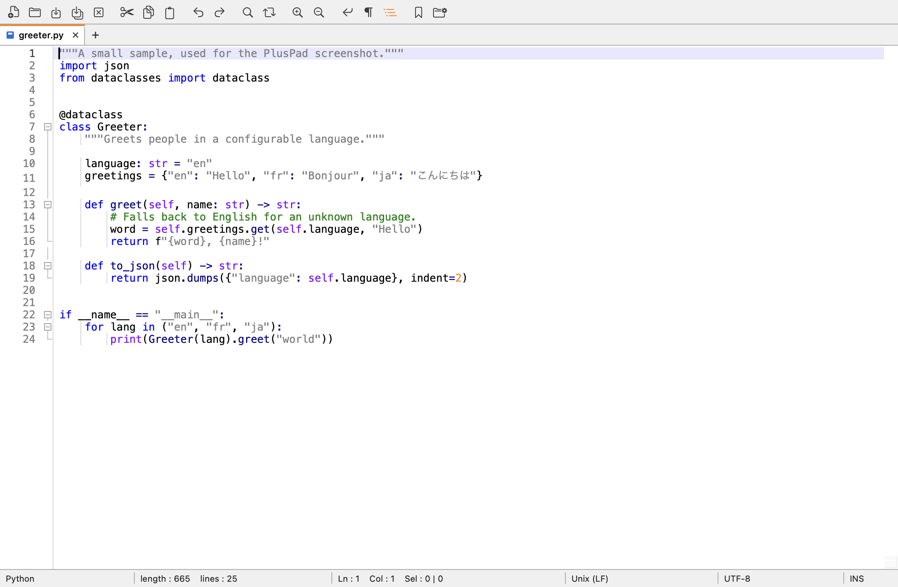

# PlusPad

A Notepad++-style text editor for macOS. Native AppKit, one `swiftc` invocation,
no dependencies.

Notepad++ has never shipped a Mac build and the usual answers -- Wine, a VM, or
"just use BBEdit" -- all lose the thing people actually want: tabs that are
always there, encoding and line endings on the status bar, a real regex
find-and-replace, and a pile of line operations one keystroke away.



## The one rule

**PlusPad never asks you to save.**

There is no "Save changes?" sheet on quit, on closing a tab, or anywhere else.
Instead every buffer is mirrored continuously into a workspace folder:

- **Unsaved tabs survive quitting.** Relaunch and they are back, with the cursor
  and scroll position where you left them.
- **Closing a tab is reversible.** A tab with unsaved changes is parked in
  `Recently Closed`, not discarded. File > Reopen Closed Tab (Cmd Shift T)
  brings it back.
- **A crash loses nothing.** Backups are written on a debounce after you stop
  typing, every twenty seconds regardless, and whenever the app loses focus. The
  next launch notices the unclean shutdown and says what it recovered.
- **Recovery does not need the app.** Backups keep their original name and
  extension, and `Backups/index.txt` maps each one back to where it came from.
  If PlusPad will not start, open the folder in the Finder and copy your text
  out.
- **Uninstalling PlusPad does not touch the workspace.** It lives outside the
  application bundle and outside the system's application-support folders, so
  dragging the app to the Trash leaves every unsaved file exactly where it is,
  in plain UTF-8. Reinstall later, point PlusPad at the same folder, and the
  tabs come back -- including ones that were never saved to a file, and even if
  `session.json` is missing or damaged, because the app will rebuild the tabs
  from the files in `Backups/` directly.
- **A backup is never quietly collected as garbage.** If a backup file exists
  that the session does not account for, it is opened as a tab rather than
  deleted. The session file is an index; the text is the thing that matters, and
  the two are not allowed to disagree in the direction that loses work.

## New and unsaved files

Notepad++'s behaviour, matched point for point:

- A fresh buffer is called **`new 1`**, then `new 2`, and so on. The counter
  only goes up -- a number belonging to a closed tab is never handed out again,
  so two tabs can never share a name.
- **Opening a file replaces a single untouched empty buffer** rather than
  opening beside it, so "launch, open a file" leaves one tab, not two. A buffer
  with anything in it is never replaced.
- Opening a file that is already open **focuses its tab** instead of opening a
  second copy of it.
- An untouched empty buffer **is not modified**, and closing it archives
  nothing. Typing one character makes it modified.
- **Closing the last tab leaves a fresh empty one.** The window is never
  tabless.

The one deliberate difference: Notepad++ asks "Save file before closing?".
PlusPad never does. See below for what it does instead.

## The workspace folder

Everything PlusPad remembers lives in one folder, and you choose where. It asks
once on first launch; change it later from Settings > Workspace Folder, which
moves the contents with it.

```
PlusPad/
  session.json          which tabs are open, order, cursor, scroll
  settings.json         theme, font, tab width, the rest
  Backups/              live copy of every open tab
    index.txt           which backup came from which file
    config~3f9a2b1c.yaml
  Recently Closed/      tabs you closed that had unsaved changes
  README.txt            this layout, explained in the folder itself
```

The default is `~/Documents/PlusPad` rather than `~/Library/Application Support`
on purpose: recovery means opening the folder in the Finder, and Application
Support is hidden by default.

## What it does

**Editing.** Tabs with drag-to-reorder, middle-click close and a red disk marker
for unsaved. Syntax highlighting for about thirty languages. Line numbers,
bookmarks in the gutter, indent guides, current-line highlight, invisible
characters, bracket matching, and highlighting of other occurrences of the
selection. Auto-indent, auto-closing brackets, tab-indents-selection.

**Search.** Find, Replace and Find in Files, each in Normal, Extended (`\n`,
`\t`, `\xNN`) or Regular expression mode, with match case, whole word, wrap
around and in-selection. Count, Find All and Mark All. Replace across every open
tab. Find in Files skips `.git`, `node_modules` and friends, and results open in
their own tab.

**Encoding and line endings.** Detected on open, shown in the status bar,
changeable from a click. Convert the text, or reopen the bytes under a different
encoding -- two different things, kept apart.

**Folding.** A fold column beside the line numbers with box markers and guide
lines, click to fold, plus Fold All, Unfold All and Toggle Fold. Regions come
from indentation, so every language folds without a per-language fold parser --
the trade is that a construct whose body is not indented, such as an HTML tag
whose children sit at the same column, will not offer a fold where Notepad++
would.

**Line tools.** Sort ascending, descending, case-insensitive, numeric, reversed,
shuffled. Remove duplicate, consecutive-duplicate and empty lines. Trim leading
and trailing space, tabs to spaces and back. Duplicate, delete, move, join.
Case conversion including `iNVERT cASE`, camelCase and snake_case. Comment
toggle per language. Base64, URL encoding, escaping, MD5/SHA-1/SHA-256.

## Download

Grab the zip from the [Releases](../../releases) page, unzip it, and drag the
`.app` to `/Applications`. Apple silicon only.

The binary is **ad-hoc signed and not notarised**, so Gatekeeper refuses the
first launch with "cannot be opened because the developer cannot be verified".
Either right-click the app and choose Open, or clear the quarantine flag once:

```bash
xattr -dr com.apple.quarantine /Applications/PlusPad.app
```

Notarising needs a paid Apple Developer account, which this project does not
have. If you would rather not take a stranger's binary on trust -- a reasonable
position -- build from source instead. It takes about fifteen seconds.

Verify a download against `SHA256SUMS.txt` on the release:

```bash
shasum -a 256 -c SHA256SUMS.txt
```

## Build

Requires the Xcode command line tools and macOS 14 or later.

```bash
cd PlusPad && ./build.sh --install
```

Without `--install` the bundle is left in `build/`.

## Verifying it

Three layers, all runnable from a terminal:

```bash
./run-tests.sh     # 82 logic checks
./run-selftest.sh  # 127 checks driving the real menu commands against a real window

PLUSPAD_DIAG=1 ./build/PlusPad.app/Contents/MacOS/PlusPad   # view tree, action audit, PNG
```

`run-tests.sh` covers the pure logic: encoding detection, the incremental line
index, the syntax scanner, line transforms, the search engine.

Run the self test through `run-selftest.sh` rather than setting
`PLUSPAD_SELFTEST=1` by hand. It closes tabs, flips settings and writes backups,
so the script points it at a throwaway workspace via `PLUSPAD_WORKSPACE` first;
the app refuses to run it against a real one, because it would throw away
whatever you had open.

The **self test** drives the actual menu commands against a real window and
checks what they did -- that Encoding > UTF-16 LE changes the document's
encoding, that Toggle Comment round-trips, that Fold All hides lines without
removing text, that closing an unsaved tab parks it in Recently Closed and
Reopen Closed Tab brings the exact text back. Commands that open a panel are
listed as needing a person rather than silently skipped.

The **action audit** walks every menu item and every control and reports any
whose action nothing in the responder chain implements, plus duplicate key
equivalents. A menu item wired to a stale selector is otherwise completely
silent: enabled, normal-looking, and does nothing.

## Checking the UI without a screen

The app can render itself to a PNG, which works without the Screen Recording
permission that `screencapture` requires:

```bash
PLUSPAD_DIAG=1 ./build/PlusPad.app/Contents/MacOS/PlusPad
# writes /tmp/pluspad-render.png and /tmp/pluspad-diag.log, then quits

PLUSPAD_DIAG=1 PLUSPAD_DIAG_FIND=1 ./build/PlusPad.app/Contents/MacOS/PlusPad
# captures the Find panel instead
```

The log carries the whole view tree with frames. This exists because a view can
have a perfectly correct frame and still draw nothing, and the difference is
invisible from the outside.

## Keyboard

Notepad++'s shortcuts with Command in place of Control. Three could not be
carried over and take the Mac convention instead:

| Command | PlusPad | Notepad++ | Why |
| --- | --- | --- | --- |
| Replace | Cmd Opt F | Ctrl H | Cmd H is Hide, reserved by macOS |
| Go to Line | Cmd L | Ctrl G | Cmd G is Find Next on macOS |
| Toggle Comment | Cmd / | Ctrl Q | Cmd Q is Quit |

## Not there yet

Column-mode editing and multiple cursors, macro record and playback, the
function list and document map, split view, and a plugin system. Folding is by
indentation rather than by language.
These are real parts of Notepad++ and their absence is a gap, not a decision
that they do not matter.

## Related

Two sibling projects, same idea and same constraints -- plain Swift, no
dependencies, one shell script to build:

- [Directories](https://github.com/akgoyal1987/Directories) -- a
  Windows-Explorer-style file navigator
- [DockToggle](https://github.com/akgoyal1987/DockToggle) -- closing an app's
  last window quits it, so unpinned icons leave the Dock

## Contributing

Issues and pull requests are welcome. See [CONTRIBUTING.md](CONTRIBUTING.md) for
how the code is laid out and what to run before opening one.

## About

I am **Ankit Goyal**, a software engineer working on data platform and
distributed systems.

PlusPad started because I moved to a Mac and kept reaching for Notepad++, which
has never shipped a Mac build. It turned into an exercise in seeing how far
plain AppKit and TextKit go with no dependencies at all -- the answer was
further than I expected.

GitHub: [@akgoyal1987](https://github.com/akgoyal1987)

## Licence

MIT. See [LICENSE](LICENSE).
